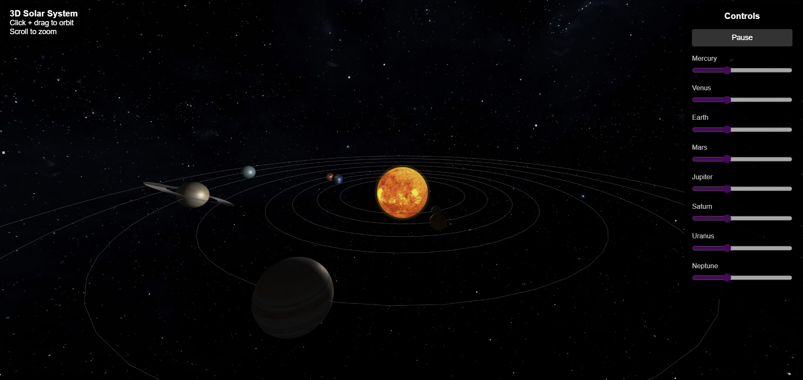

# Solar System 3D

This is a 3D Solar System simulation built with **Three.js**. It includes:
- The Sun with a glow effect
- All 8 planets with realistic textures
- Saturn’s rings
- Orbit paths
- A starfield background
- Interactive camera controls and speed sliders
- Planet labels

---

## **How to Run**

1. **Clone the repository**
   ```bash
   git clone https://github.com/CodeWithPiyush0/solar-system-3d
   ```
   

2. **Navigate to the project folder**
   ```bash
   cd solar-system-3d
   ```

3. **Open `index.html`**  
   Just open `index.html` in your browser.  
   No server needed — it works locally!

---

## **Project Structure**

```
solar-system-3d/
 ├── index.html      # Main HTML file
 ├── style.css       # Styling
 ├── script.js       # All Three.js logic & animations
 └── textures/       # Folder with all texture images (planets, sun, stars, Saturn’s ring)
```

---

## **Features**

-  Realistic Sun and planets with textures
-  Saturn’s rings generated with transparency
-  Orbit lines to visualize planet paths
-  Starfield background sphere
-  Planet name labels on hover
-  Camera drag to rotate & zoom
-  Controls to adjust speed of each planet
-  Pause / Resume animation

---

##  **Screenshots**



---

## Demo Video

[ Watch the Demo Video](https://drive.google.com/file/d/1pW9IkvMQNg-zMgWbURyylSG8khUnWWW7/view?usp=sharing)

---

##  **Credits**

Built using [Three.js](https://threejs.org/).  
Textures sourced from NASA & other open sources.

---

##  **Author**

**Piyush Kumar**  
[https://github.com/CodeWithPiyush0](https://github.com/CodeWithPiyush0)

---

